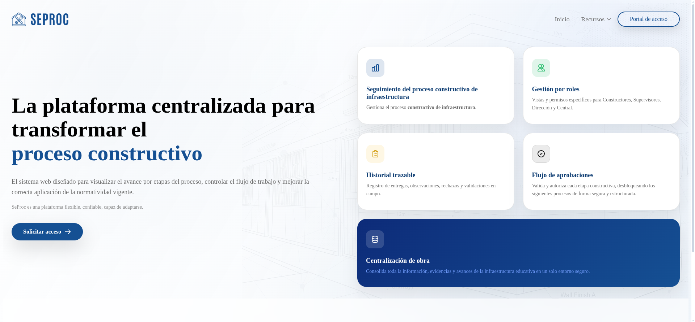
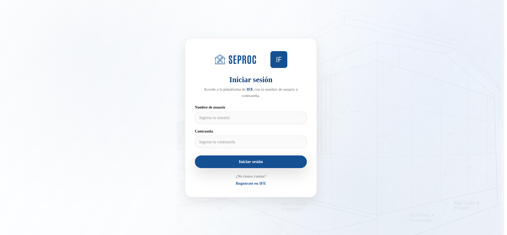
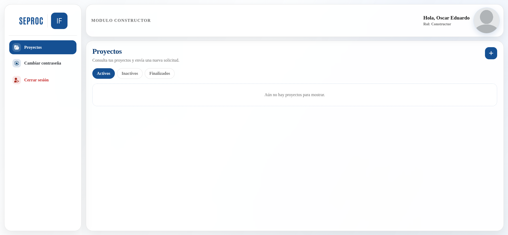
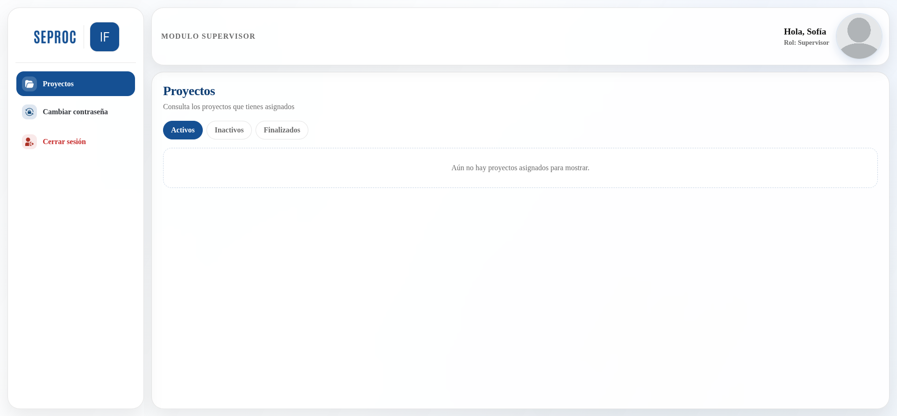
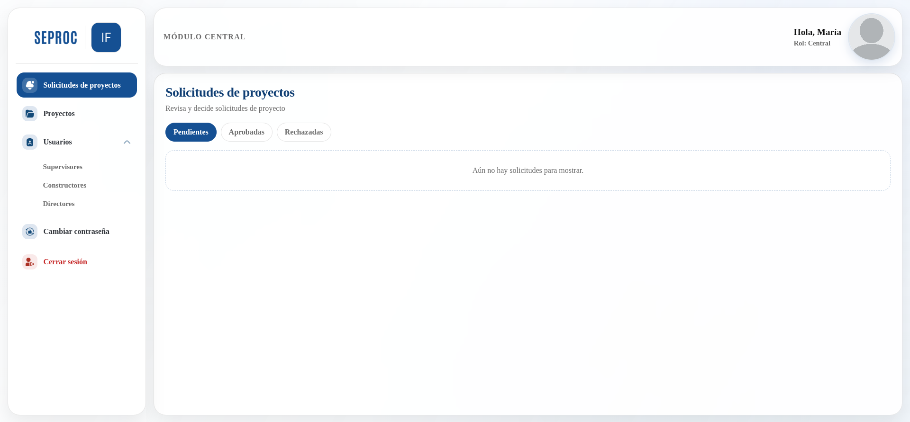
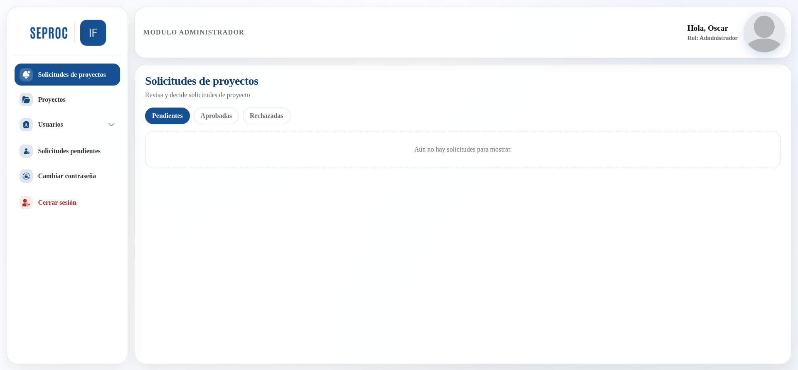
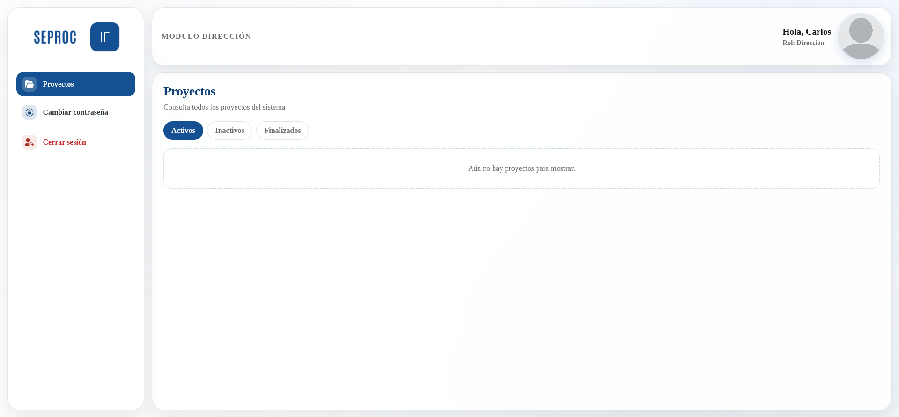
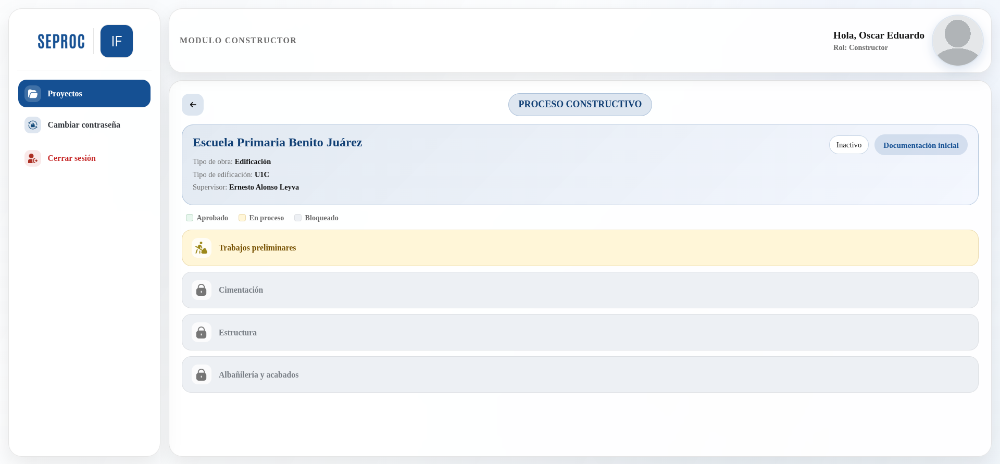

# SeProc frontend

Sistema web para la gestión y seguimiento del proceso constructivo de aulas tipo.

## Descripción

SeProc es un sistema web desarrollado para apoyar el seguimiento del proceso constructivo de aulas tipo. Este repositorio contiene la interfaz de usuario del sistema, desarrollada con Angular.

El frontend permite visualizar el avance de los proyectos por etapas, acceder a las funciones correspondientes a cada rol y consultar el historial de entregas, observaciones y revisiones. También proporciona las pantallas de autenticación, registro y los distintos paneles de control del sistema.

El sistema está orientado a las dependencias encargadas de la construcción y supervisión de infraestructura educativa.

## Objetivo

Facilitar el control y seguimiento de proyectos de construcción mediante una interfaz web que permita:

- Visualizar el avance por etapas del proceso constructivo.

- Mostrar vistas y acciones de acuerdo con el rol del usuario.

- Consultar el historial de avances, entregas y observaciones.

- Dar seguimiento a los proyectos en ejecución.

- Facilitar la comunicación entre las áreas participantes.

## Roles del sistema

El sistema contempla distintos tipos de usuario:

- **Constructor**
- **Supervisor**
- **Central**
- **Administración**
- **Dirección**

Cada rol cuenta con un panel y acciones específicas de acuerdo con su participación dentro del flujo del proceso constructivo.

## Funcionalidades principales

- Inicio de sesión para usuarios e instituciones.

- Registro de instituciones.

- Paneles de control diferenciados por rol.

- Protección de rutas mediante guards.

- Seguimiento del avance de proyectos por etapas.

- Desbloqueo de procesos conforme al flujo del proyecto.

- Visualización del historial de entregas, revisiones y observaciones.

- Consulta de proyectos y detalle de avance.

- Comunicación con el backend mediante servicios.

- Interfaz web responsiva.

## Capturas del sistema

### Página principal

### Inicio de sesión

### Panel del constructor

### Panel del supervisor

### Panel central

### Panel de administración

### Panel de dirección

### Seguimiento del proyecto

## Tecnologías utilizadas

- **Frontend:** Angular, TypeScript, HTML5, CSS3
- **Navegación:** Angular Router
- **Comunicación con el backend:** servicios HTTP de Angular

## Estado del proyecto

Proyecto en desarrollo como parte de residencia profesional.

## Repositorio

Este repositorio contiene el frontend del sistema SeProc.

## Autores

Desarrollado por el equipo del proyecto SeProc.